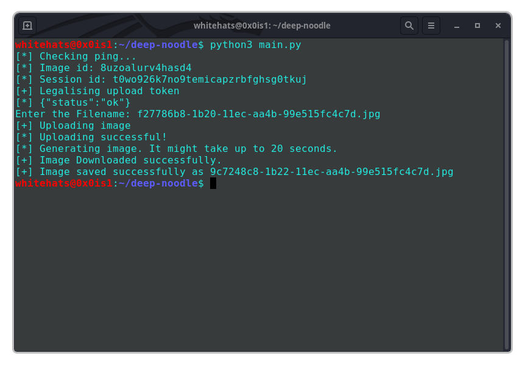

# Cricbot 2.0 - ESPN cricket discord bot

[](https://saythanks.io/to/0x0is1off@gmail.com)

[](https://discord.gg/PyzaTzs2cF)


## Description
DeepNoodle is client version of (deepnudes.to) using [Deepnoodle API](https://github.com/0x0is1/DeepNoodle-API) developed by [0x0is1](https://github.com/0x0is1) to provide service within a CLI without any daily limit. A [GUI version](https://github.com/0x0is1/deepnoodle-GUI) available of it using python3.

## Usage

* Download this repository directly or by using git cli i.e-

```css
> git clone https://github.com/0x0is1/DeepNoodle-CLI
> cd DeepNoodle-CLI
> python3 -m pip install requirements.txt
> python3 main.py
```

## Requirements
* Python3.5+
* python-requests (requests)
* pillow-python (PIL)

## Compatibilty 

Any device that can run Python3.5+ including raspberry pi and other OS'es.

## Feedback and bug report

Send feedback or bug report to our developers on this (0x0is1@protonmail.com).

## Previews
 </img>

### **Support authors**:

[](https://www.buymeacoffee.com/6dciIwk)

[](https://paypal.me/0x0is1?locale.x=en_GB)

